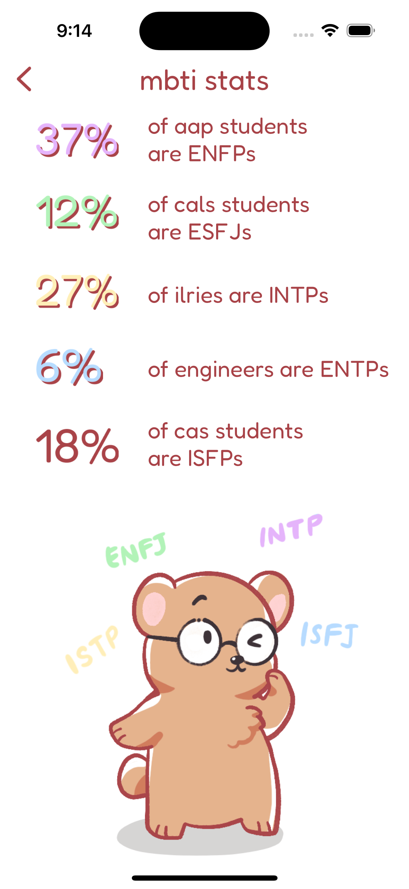

# Cornell Types Frontend

An app to share and discuss MBTI Personality Types for the fellow Cornell community.

## Screenshots

     

## Backend

[https://github.com/tg329/cornell-types/tree/backend](https://github.com/tg329/cornell-types/tree/backend)

## Members

Frontend:
- Alvaro Deras (ad2226)
- Max Larsson (ml2735)
- David Lee (dwl75)

Backend:
- Hannah Zhou (hyz4)
- Lakshmi Meghana Kesanapalli (lk496)

Design:
- Shihan Gao (tg329)
